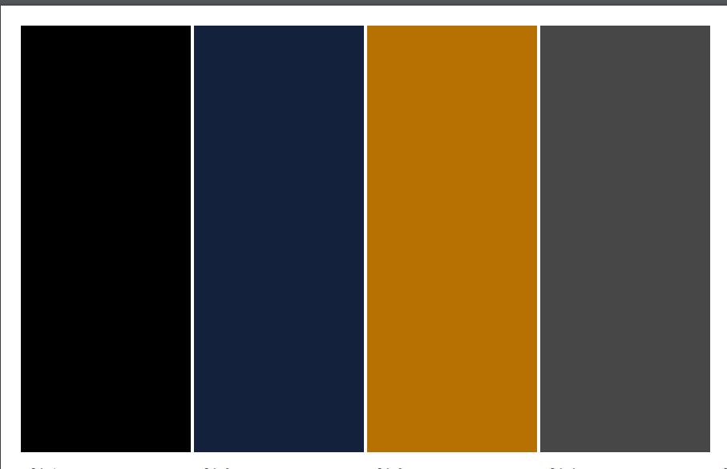

# Weather App

___

The reason of making this site is that to help people to travel in different places of Hollland, and this will help the travelers to know the temperature of any place of there choice they would like to go without not knowing the weather forecast.

### Content

___

* UX
    1. User Stories
        1. Visitors Goals
        2. Returning Visitor Goals
        3. Frequent User Goals 
    2. Design Choices   
        * Icons
        * Colors
        * Fonts
        * styling 
    3. Features
    4. Technologies Used
        * Languages Used
        * Libraries & Framework
        * Tools
    5. Testing
    6. bugs
    7. Deployment
    

# UX (User Experience)
___

## User Stories:
### 1. Visitors Goals

* The main goal in here is to let the users to  understand the main purpose of the site and learning more about the project.
* As the user I want to be able to navigate the site and to alocate all their **social media**, __links__ and  __inputs__ either they work really good or not.
* As the visitor I would like to see how really the app works if there are any extras added to make it unique like temperatures.

### Returning Visitor Goals:

* As a user I keep on checking to see if the weather app has got more functions to make it easier for anyone using it.
### Frequent User Goals
* As a Frequent User, I want to check to see if there are any newly added Icons of 3D format which makes the app look so good and real .
* As a Frequent user for the app I would like to check if the the app has got more links which are so helpful to the any user .So as if the app has got acculate time of and so fouth.
## Design Choices:
___

#### Icons
I used Font Awesome Icons in this project and are basically provided on this link [Font Awesome](https://fontawesome.com) and are **easly applied** to your website, used in __moderation__ and are self explanatory as you will be seeing.

### Fonts:
For this project I'm going to use Sans Serif and JP [Noto](https://fonts.google.com/specimen/Noto+Sans+JP) however I found this would be a great much the project .

### Colors:
1. I have sofar picked up four types of colors, and in my understanding they will make the weather app project look quiet pretty and in appearance looks promising.
2. These are the colors am gonna use in my project.

These are the main colours that am gonna use in this weather project.

* For body text and some titles: White #ffffff;
* For the the background image: Oxford Blue #14213D;
* For the border and social media background: Ochre #B67102;
* For the font Icons the background-color: Black  #000000;
* For the footer background-color I used: Davys Gray #474747;

## Features
___
* Responsive on all device sizes
* Interactive elements

## Technologies Used
___

### Languages Used
* [HTML5](https://en.wikipedia.org/wiki/HTML5)
* [CSS3](https://en.wikipedia.org/wiki/CSS)
* [JavaSCRIPT](https://en.wikipedia.org/wiki/JavaScript)

## Libraries & Frameworks 
1. [Bootstrap 4.5.0:](https://getbootstrap.com/docs/4.4/getting-started/introduction/)
  * __I__ used **Bootstrap** to **assist** with the responsiveness and styling of the website.
2. [Git:](https://git-scm.com/)
  * __Git__ was used for version control by utilizing the Gitpod terminal to commit to Git and Push to GitHub. 
3. [GitHub:](https://github.com/)
  * __I__ used **GitHub** to store the projects code after being pushed from __Git__.
4. [Font Awesome:](https://fontawesome.com/)
  * __Font__ Awesome was used on the footer  page the website to add **icons** for social media.
5. [Hover.css:](https://ianlunn.github.io/Hover/)
  * __Hover.css__ was used on the Social Media icons in the footer to add the float transition while being __hovered__ over. 
6. [Google Font:](https://fonts.google.com/)  
  * __Google fonts__ were used to import the 'Noto+Sans+JP' font into the style.css file which is used in the project. 

## Testing
___
The W3C Markup Validator and W3C CSS Validator Services were used to validate every page of the project to ensure that there were no syntax errors in the project.

* [W3C Markup Validator](https://validator.w3.org/)
* [W3C CSS Validator](https://jigsaw.w3.org/css-validator/)

## Testing User Stories from User Experience (UX) Section

### Visitors Goals:
  * As a user for this site I make sure to see that the search box is  as clean and easily used,and working perfectly. Under the search section there is a name for the city followed by the and the month.
  * The userb also has got an option of typing in the search bar for knowing the weather forecast of the day and also easily to navigate throughout the site by going down to the footer section.
### Returning Visitor Goals:
  * As a Returning Visitor, I want to find the best way to get in contact with the organisation with any questions I may have.
  * As a Returning Visitor, I want to find different kind of social media links so that I can join and interact with others in the community.
### Frequent User Goals:
  * As a Frequent User, I want to sign up to the various social links  so that I am emailed any major updates and/or changes to the website or organisation.  
  * At the bottom of every page their is a footer which content is consistent is at the bottom of the pages. 

## Bugs

# Deployment

## GitHub Pages
The project was deployed to GitHub Pages using the following steps.
 
  1. Log in to __GitHub__ and locate the [GitHub Repository](https://github.com/)
  2. At the top of the **Repository** locate the "Settings" Button on the menu.
  3. Scroll down the Settings page until you locate the __"GitHub Pages"__ Section.
  4. Under "Source", click the dropdown called "None" and select __"Master Branch"__.
  5. The page will automatically refresh the gitHub.
  6
